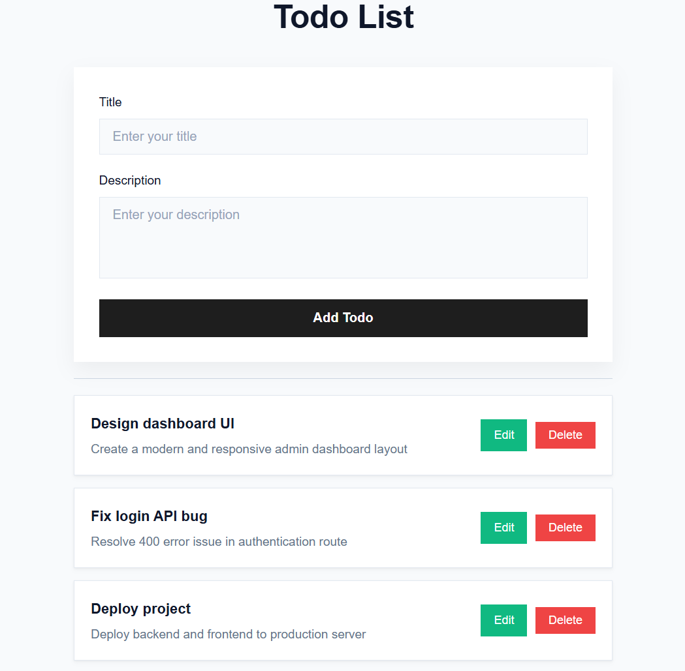
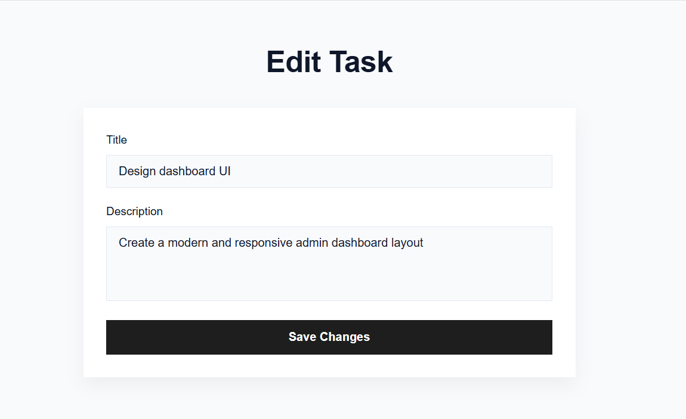

# 📝 Node.js Express Todo App

A simple, fast, and modern Todo List application built with Node.js, Express, and EJS. This app allows users to create, read, update, and delete (CRUD) tasks efficiently, featuring a responsive and clean UI.

---

## 📸 Preview




---

## ✨ Features

* 📋 View all tasks with title and description
* ➕ Add new tasks instantly
* ✏️ Edit existing tasks
* ❌ Delete tasks with confirmation
* 🎨 Clean and responsive UI with modern styling

---

## 🛠️ Tech Stack

* **Backend:** Node.js, Express.js (v5.1.0)
* **Templating Engine:** EJS
* **Styling:** CSS3
* **Dev Tool:** Nodemon

---

## 📁 Project Structure

```
todo-app/
├── public/
│   └── css/
│       └── style.css
├── views/
│   ├── index.ejs
│   └── edit.ejs
├── app.js
├── package.json
└── README.md
```

---

## 🚀 Getting Started

### 🔹 Prerequisites

Make sure you have installed:

* Node.js

---

### 🔹 Installation

```bash
# Clone the repo
git clone https://github.com/masterSahil/todo-app.git

# Navigate into the folder
cd todo-app

# Install dependencies
npm install
```

---

### ▶️ Run the App

```bash
# Run using nodemon
npm run dev

# OR run normally
node app.js
```

Open your browser and go to:

👉 [http://localhost:8020](http://localhost:8020)

---

## 💡 Note on Data Storage

⚠️ This app currently uses **in-memory storage**.

* All tasks are stored in a local array
* Data will reset when the server restarts

👉 For production, integrate a database like MongoDB.

---