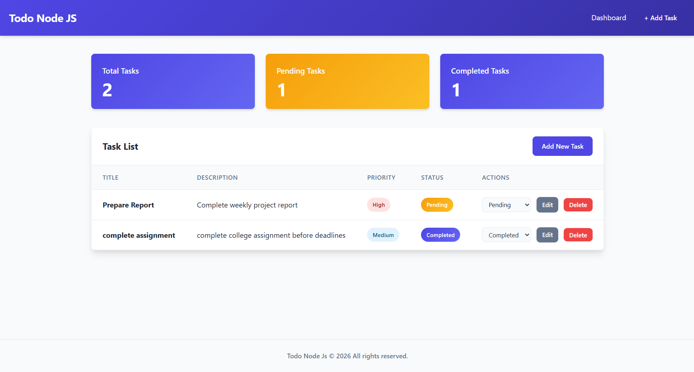
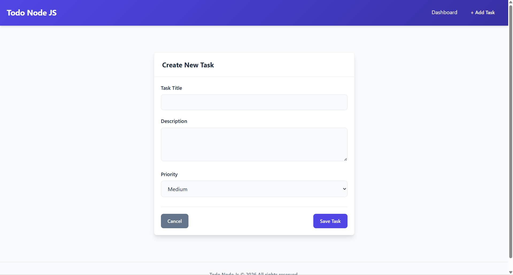
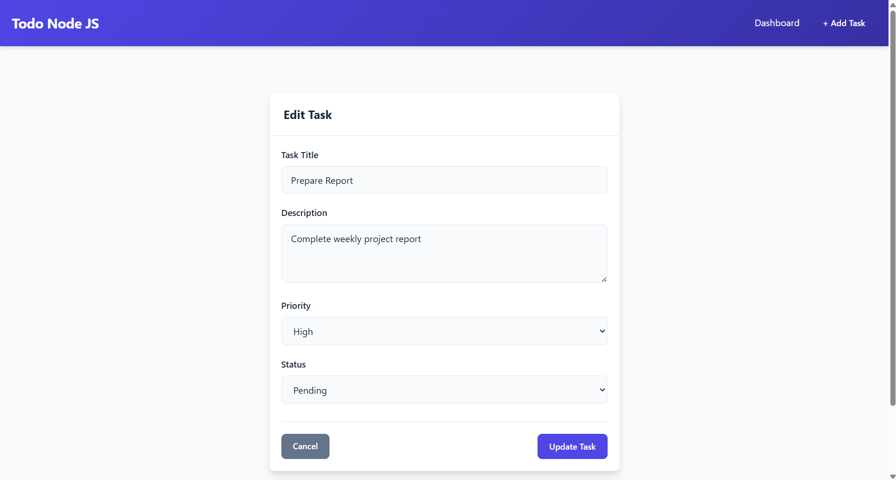
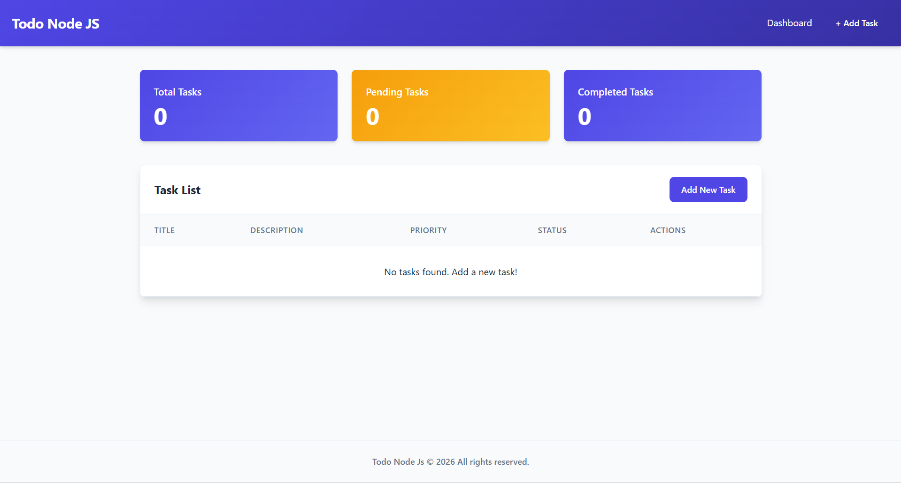

# 📝 TodoApp Pro — Professional Task Management System

A **modern, real-time Todo Management System** built with **Node.js, Express, and EJS**. This app goes beyond basic CRUD by offering a **clean dashboard, real-time stats, and advanced task tracking** for productivity-focused users.

---
### 📊 Dashboard



### ➕ Add Task



### ➕ Edit Task



### ➕ Empty



---

## ✨ Key Features

* 📊 **Real-Time Dashboard**
  View total, pending, and completed tasks instantly.

* 📋 **Full CRUD Operations**
  Create, read, update, and delete tasks seamlessly.

* 🏷️ **Advanced Task Tracking**
  Manage tasks with:

  * Priority: High / Medium / Low
  * Status: Pending / In Progress / Completed

* 🔄 **Quick Status Updates**
  Change task status directly from dashboard.

* 🎨 **Premium UI/UX**

  * Clean grid layouts
  * Smooth hover effects
  * Soft shadows
  * Fully responsive design

* 🧩 **Modular Code Structure**
  Reusable EJS partials for maintainability.

---

## 🛠️ Tech Stack

| Layer     | Technology                  |
| --------- | --------------------------- |
| Backend   | Node.js, Express.js         |
| Frontend  | EJS Templates               |
| Styling   | Custom CSS (Flexbox + Grid) |
| Dev Tools | Nodemon                     |

---

## 📁 Project Structure

```bash
todo-app/
├── public/
│   ├── css/
│   │   └── style.css
│   └── screenshot/
├── views/
│   ├── partials/
│   │   ├── header.ejs
│   │   └── footer.ejs
│   ├── index.ejs
│   ├── add-task.ejs
│   └── edit-task.ejs
├── app.js
├── package.json
└── README.md
```

---

## ⚙️ Getting Started

### 🔹 Prerequisites

Make sure you have installed:

* Node.js (v18+ recommended)
* npm (comes with Node)

---

### ▶️ Run the Application

```bash
# Run in development mode
npm run dev

# OR run normally
node app.js
```

---

## 🌐 Access the App

Open your browser and visit:

👉 [http://localhost:8020](http://localhost:8020)

---

## 📌 Future Improvements

* 🔐 User Authentication (Login / Signup)
* ☁️ Database Integration (MongoDB / Firebase)
* 📱 Progressive Web App (PWA)
* 📊 Advanced Analytics Dashboard
* 🌙 Dark Mode Support

---

## 🤝 Contributing

Contributions are welcome!

1. Fork the repository
2. Create your feature branch (`git checkout -b feature/AmazingFeature`)
3. Commit your changes (`git commit -m 'Add AmazingFeature'`)
4. Push to the branch (`git push origin feature/AmazingFeature`)
5. Open a Pull Request

---

## 📄 License

This project is licensed under the MIT License.

---

## 👨‍💻 Author

**Sahil Master**

* GitHub: [https://github.com/masterSahil](https://github.com/masterSahil)

---