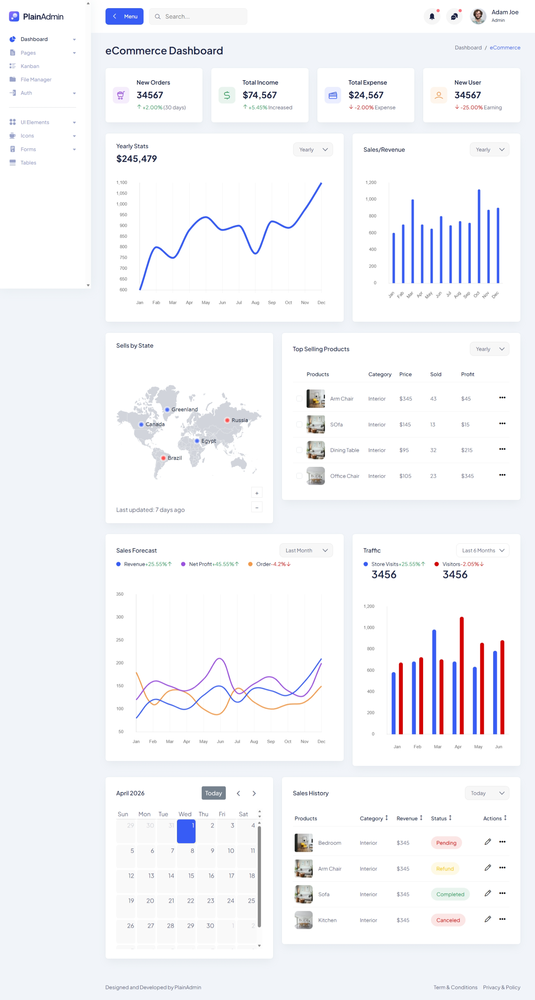
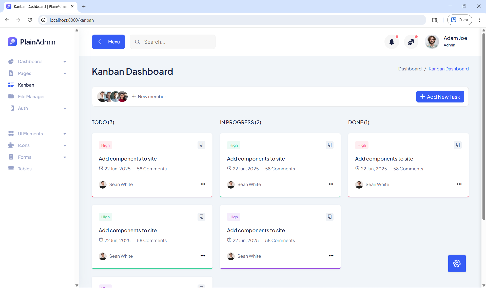

# 📦 Admin Panel – HTML to Node.js (MVC)

A fully structured Admin Dashboard converted from plain HTML into a scalable Node.js MVC architecture. This project demonstrates how to transform a static frontend into a dynamic backend-driven application.

---

## 🚀 Overview

This project started as a static HTML admin template and was refactored into a proper MVC (Model-View-Controller) structure using Node.js.

It helps in:

* Organizing code efficiently
* Making the project scalable
* Preparing the app for database integration
* Separating concerns (logic, UI, routing)

---

## 🏗️ Project Structure

```bash
project-root/
│
├── controllers/     # Business logic
├── models/          # Data handling (DB ready)
├── routes/          # Application routes
├── views/           # Templates (EJS/HTML)
├── public/          # Static assets (CSS, JS, Images)
│   └── assets/
│
├── app.js           # Main app entry
├── package.json
└── README.md
```

---

## ⚙️ Features

* ✅ Converted static HTML into dynamic Node.js app
* ✅ MVC architecture implemented
* ✅ Reusable layouts and components
* ✅ Static asset management
* ✅ Clean routing system
* ✅ Ready for database integration

---

## 🖼️ Screenshots

Add your screenshots below 👇




---