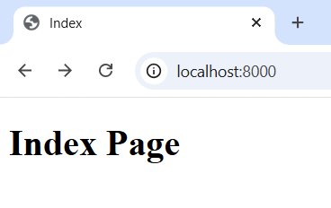
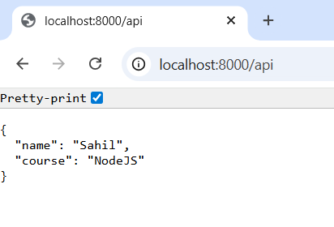
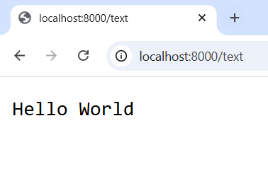
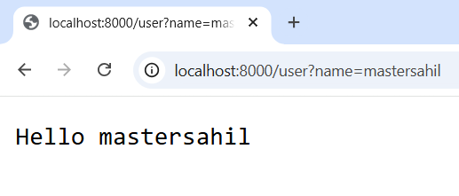

# 🚀 Custom Server Builder (Node.js)

## 📌 Project Overview

This project is a basic HTTP server built using Node.js without using Express.js.
It handles multiple routes, different response types, query parameters, and proper status codes.

---

## 💡 Objective

* Create a server using Node.js `http` module
* Handle multiple routes
* Send HTML, JSON, and plain text responses
* Manage query parameters
* Implement proper status codes (200, 404, 500)

---

## 🛠️ Technologies Used

* Node.js
* http module
* fs module
* querystring module

---

## 📂 Project Structure

```
project-folder/
│
├── index.js
├── index.html
├── about.html
├── contact.html
├── 404.html
└── README.md
```

---

## 🔗 Available Routes

| Route              | Description             |
| ------------------ | ----------------------- |
| `/`                | Home page               |
| `/about`           | About page              |
| `/contact`         | Contact page            |
| `/api`             | JSON response           |
| `/text`            | Plain text response     |
| `/user?name=Sahil` | Query parameter example |

---

## ⚡ Features

### ✅ HTML Response

Serves HTML files using `fs.readFile`

### ✅ JSON Response

Returns JSON data at `/api`

### ✅ Plain Text Response

Returns simple text at `/text`

### ✅ Query Parameters

Handles query like:

```
/user?name=Sahil
```

### ✅ Status Codes

* `200` → Success
* `404` → Page Not Found
* `500` → Server Error

---

## 🔄 Development Tool

This project uses **nodemon** for automatic server restart during development.

Instead of manually restarting the server after every change, nodemon watches file changes and reloads the server automatically.

## ▶️ How to Run

1. Install Node.js
2. Install nodemon:

```
npm install nodemon
```

3. Run the server using nodemon:

```
npm run dev
```

4. Open browser:

```
http://localhost:8000
```

---

## 📸 Example URLs

* http://localhost:8000/
  
* http://localhost:8000/about
* http://localhost:8000/contact
* http://localhost:8000/api
  
* http://localhost:8000/text
  
* http://localhost:8000/user?name=Sahil
  

---

## 🎯 Learning Outcomes

* Understanding of Node.js core modules
* Routing without Express.js
* Handling HTTP requests and responses
* Working with query parameters
* File handling using `fs`

---

## 📊 Marks Coverage

| Component       | Covered |
| --------------- | ------- |
| Server Creation | ✅     |
| Route Handling  | ✅     |
| Response Types  | ✅     |
| Query Handling  | ✅     |
| Error Handling  | ✅     |

---

## 👨‍💻 Author

Sahil Master

---

## ⭐ Conclusion

This project demonstrates how to build a basic server using core Node.js modules without any frameworks, helping to understand backend fundamentals.